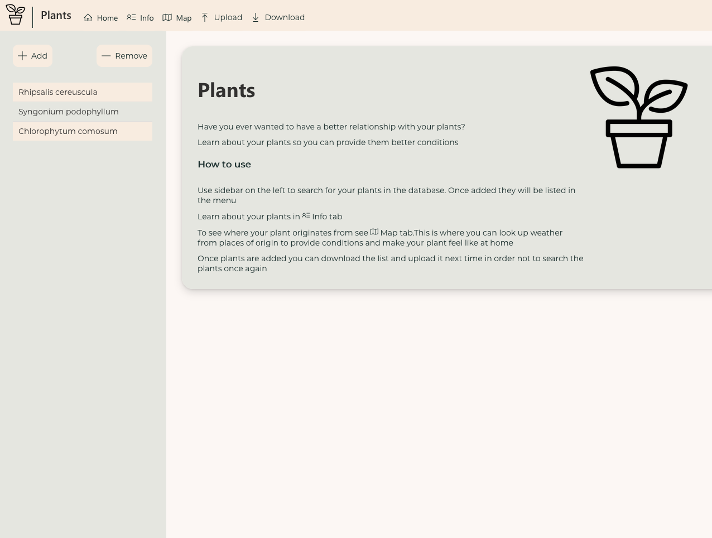
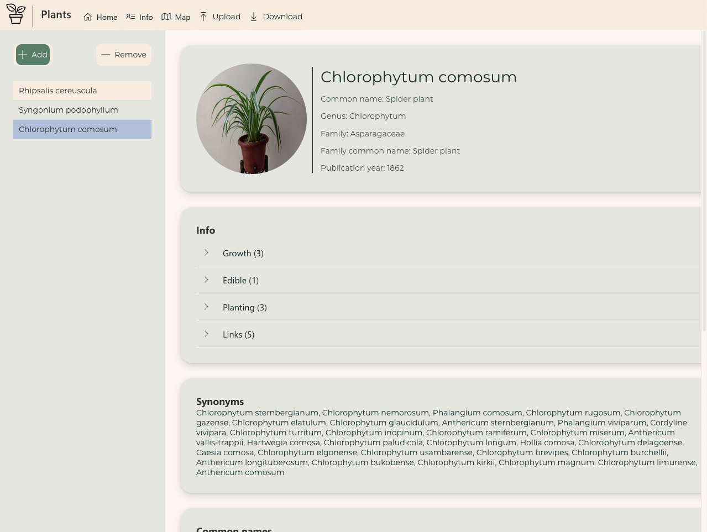
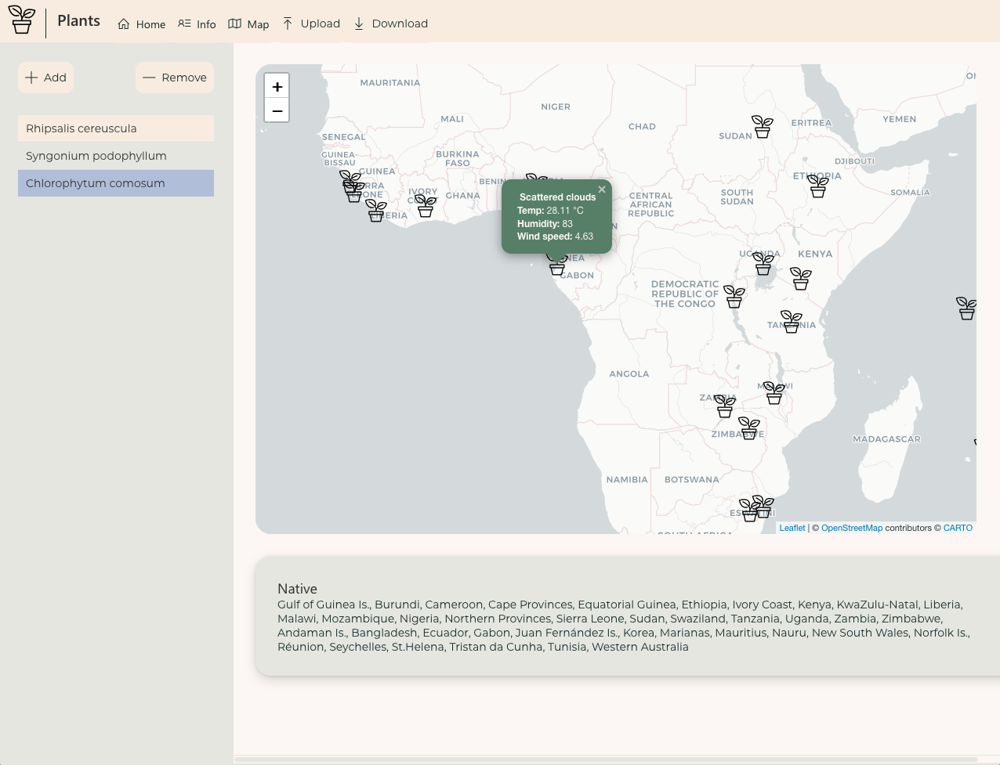

# plants - 2021 Shiny Contest entry

<!-- badges: start -->
<!-- badges: end -->

Have ever wandered how you could make life of your plants better? If the answer is positive then this app is for you! It emerged from a simple idea: how can I make my plants feel more like at home?

The app allows you to browse for your plants and check weather in the places where they originate from. Now you can provide them conditions they would be subjected to just as if they were at home! You can learn about your plants along the way thanks to info tab powered by a database obtained from brilliant Trefle API, which is unfortunately no longer up.

The app is powered by <a href="https://github.com/Appsilon/shiny.react">shiny.react</a> and <a href="https://appsilon.github.io/shiny.fluent">shiny.fluent</a> which allows to employ Microsoft Fluent UI.

The app is available at <a>https://jakub-sobolewski.shinyapps.io/plants</a>

## Interface







## Installation

The project uses `renv` for managing dependencies. In order to restore project's environment use:

```r
renv::restore()
```

and run the app with:

```r
shiny::runApp()
```

## Configuration

For testing purposes you can use `test` version of the app:

```r
Sys.setenv(R_CONFIG_ACTIVE = "test")
```

It reveals button that adds plants in order to speed up testing.

The app uses <a href="https://home.openweathermap.org/">OpenWeatherMap</a>. In order to be able to retrieve the data you need to have an API key. Store the key in `.Renviron` file or set for each session:

```r
Sys.setenv(OWM_API_KEY=<your_owm_api_key>)
```
